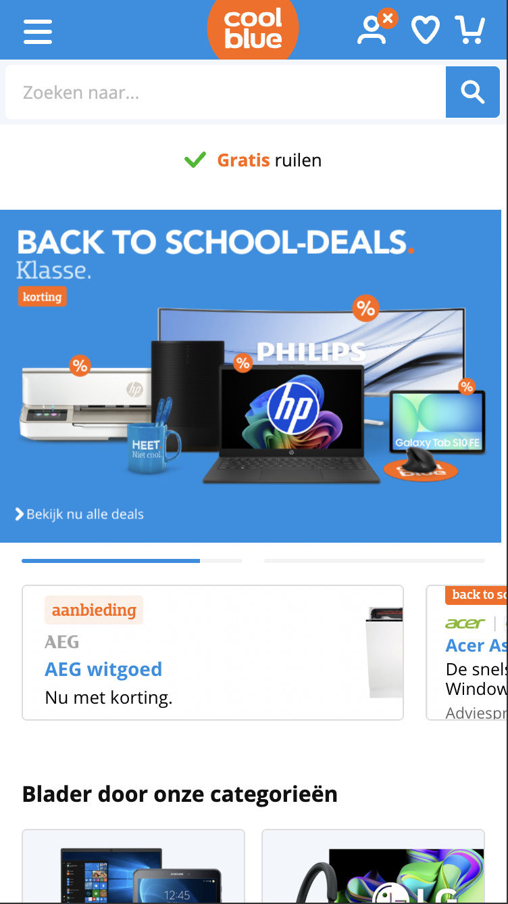
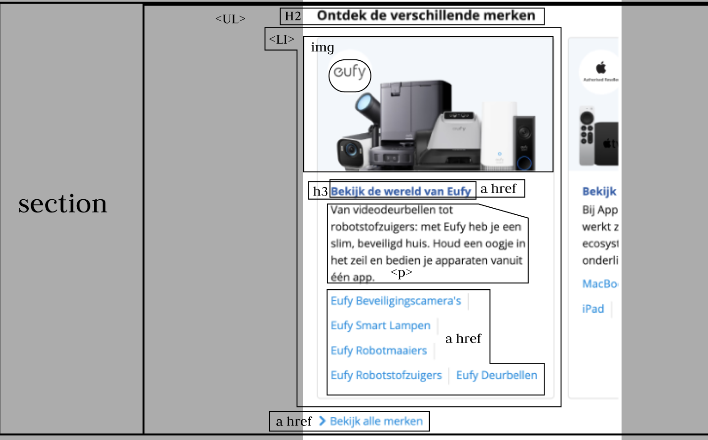
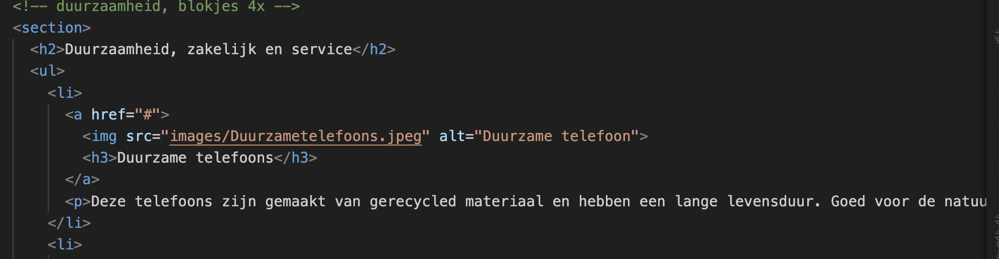
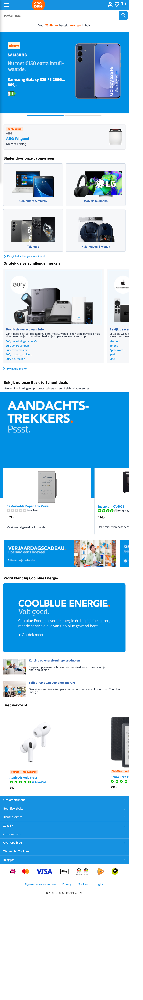
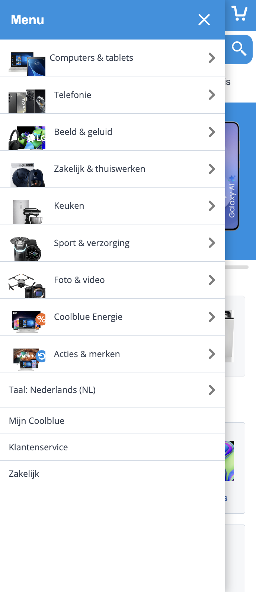
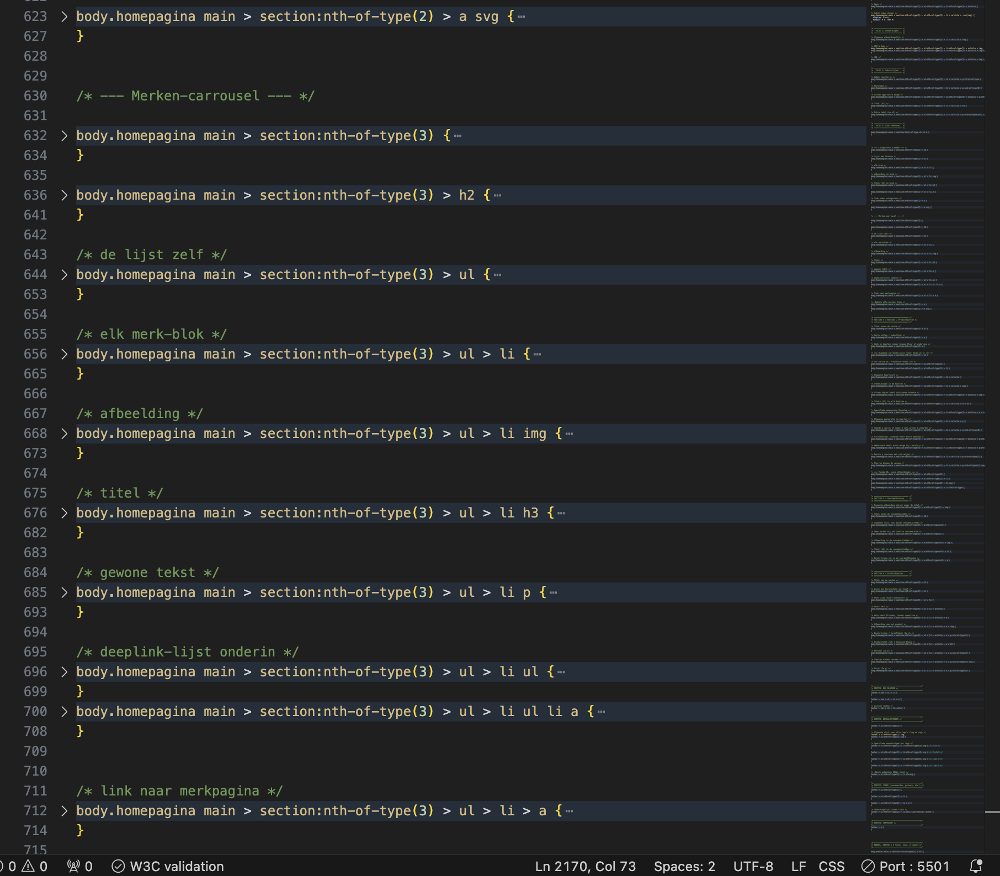
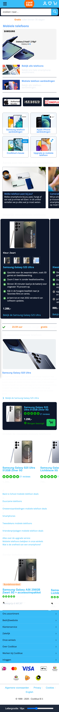

# Procesverslag
Markdown is een simpele manier om HTML te schrijven.  
Markdown cheat cheet: [Hulp bij het schrijven van Markdown](https://github.com/adam-p/markdown-here/wiki/Markdown-Cheatsheet).

Nb. De standaardstructuur en de spartaanse opmaak van de README.md zijn helemaal prima. Het gaat om de inhoud van je procesverslag. Besteedt de tijd voor pracht en praal aan je website.

Nb. Door *open* toe te voegen aan een *details* element kun je deze standaard open zetten. Fijn om dat steeds voor de relevante stuk(ken) te doen.

## Jij

  
uitwerken voor kick-off werkgroep

  ### Auteur:
  Jairo welling (vervangen door jouw naam)

  #### Je startniveau:
  blauw (kies uit zwart, rood óf blauw)

  #### Je focus:
  surface plane (kies uit responsive óf surface plane)
 

## Je website

  
uitwerken voor kick-off werkgroep

  ### Je opdracht:
  coolblue

  #### Screenshot(s) van de eerste pagina (small screen): 
  hier de naam van de pagina  
  

  #### Screenshot(s) van de tweede pagina (small screen):
  hier de naam van de pagina  
  
 

## Toegankelijkheidstest 1/2 (week 1)

  
uitwerken na test in 2e werkgroep

  ### Bevindingen
  Lijst met je bevindingen die in de test naar voren kwamen:
  de screenreader leest echt alles voor op de paginas van coolblue.
  wat mij wel is opgevallen dan op de productpagina, het toevoegen aan favoriete knopje niet word voorgelezen door de screenreader. hier ga ik dus proberen op in te spelen en dit in mijn eigen design aan te passen.

## Breakdownschets (week 1)

  
uitwerken na afloop 3e werkgroep

  ### de hele pagina: 
  
  

  ### dynamisch deel (bijv menu): 
  

  ### wellicht nog een dynamisch deel (bijv filter): 
  

## Voortgang 1 (week 2)

  
uitwerken voor 1e voortgang

  ### Stand van zaken
  hier dit ging goed & dit was lastig (neem ook screenshots op van delen van je website en code)
  het breakdownen van de schetsen ging goed, maar het in volgorde zetten van de HTML elementen was een stuk ingewikkelder dan dat het lijkt. Na een tijdje spelen en vechten met de elementen heb ik toch denk ik wel de juiste structuur gevonden.  verder heb ik ook moeite gehad met het maken van de zoekbalk. ik ben uiteindelijk eruit gekomen door de hulp van css tricks en Chat gpt.  . section>
    <form action="/zoeken" method="get">
      <input type="search" name="q">
      <button type="submit">Zoek</button>
    </form>
  </section> (voorbeeld van mijn code )

  ### Agenda voor meeting
  samen met je groepje opstellen

  | student 1      | student 2          | student 3    | student 4        |
  | Luchandro      | Noah               | Jairo        | Devin              |
  | dit bespreken  | en dit             | en ik dit    | en dan ik dat    |
  | en dat ook nog | dit als er tijd is | nog een punt | dit wil ik zeker |
  | ...            | ...                | ...          | ...              |

  ### Verslag van meeting
  hier na afloop snel de uitkomsten van de meeting vastleggen

  - punt 1: goed op weg met de code
  - punt 2: letterlijk mijn breakdown schets overtypen in html, en dan kom ik er makkelijk

## Voortgang 2 (week 3)

  
uitwerken voor 2e voortgang

  ### Stand van zaken
  hier dit ging goed & dit was lastig (neem ook screenshots op van delen van je website en code)
Hier was ik klaar met me html, en begon ik met het stijlen van de elementen via css, in het begin was het weer even inkomen met css, maar op een gegeven moment raakte ik er al gewend aan. Wat ik in het begin moeilijk vond waren de custom properties: 

## Toegankelijkheidstest 2/2 (week 4)

  
WCAG checkliste werkgroep

  ### Bevindingen
  Lijst met je bevindingen die in de test naar voren kwamen (geef ook aan wat er verbeterd is):
  de belangrijkste bevindingen die uit de test zijn gekomen, is dat ik op bijna elk onderwerp Yes heb gescoord, behalve op de 
  - Make sure that decorative images use nullalt atributes> No
  - media, website bevat geen video's, alleen een audio gedeelte dat niet vanzelf afspeelt. Dit waren vrijwel alle dingen die ik niet had, maar die wel goed zijn om niet te hebben.

## Voortgang 3 (week 4)

  
uitwerken voor 3e voortgang

  ### Stand van zaken
 Op dit moment ben ik nogsteeds bezig met het stylen van me website. ik heb bijna de eerste hele pagina af, en hoop zsm door te gaan naar de 2e pagina dit is de pagina op dit moment: 

## Eindgesprek (week 5)

  
Mijn eindproduct is een volledig nagebouwde en verbeterde versie van de Coolblue-homepagina.  
  Ik heb de structuur, het menu en de mobiele variant zelf opgebouwd met HTML, CSS en JavaScript.  
  De website bevat onder andere een werkend hamburgermenu met meerdere niveaus,  
  horizontale carrousels, en bevat 5 verschillende surface plane elementen.

  ### Je uitkomst - karakteristiek screenshots:
  
  
  

  ### Dit ging goed/Heb ik geleerd: 
  Tijdens het bouwen heb ik veel geleerd over de structuren van html en css.  
  Vooral het organiseren van code met `nth-of-type` en carrousels werkte goed.  
  Ook heb ik geleerd hoe ik een meerlagig hamburgermenu met css en javascript kan laten werken, inclusief animaties en terugknoppen.  
  Daarnaast heb ik geleerd om kleuren, marges en variabelen te gebruiken via custom prp wat mijn code overzichtelijker maakt.

   
  

  ### Dit was lastig/Is niet gelukt:
  Wat ik irritant vond, was het goed uitlijnen van afbeeldingen en tekst, 1op1 als in coolblue,  
  vooral bij het combineren van plaatjes met tekst, was het lastig.  
  Ook de witruimtes bij de mobiele carrousels waren soms moeilijk om goed te balanceren.  
  Verder werkte het toevoegen van een licht/donker-modus nog niet helemaal zoals ik wilde ,
  de kleuren veranderden, maar de contrasten waren niet altijd consistent. Het volledig werkend en compleet maken van het hamburger menu, was wel iets waar ik heel lang tegen aan heb gelopen, het is wel gelukt, maar ik had hem graag nog iets completer willen maken. Maar ik ben tevreden met het resultaat

  

## Bronnenlijst

  
continu bijhouden terwijl je werkt

  Nb. Wees specifiek ('css-tricks' als bron is bijv. niet specifiek genoeg). 
  Nb. ChatGpT en andere AI horen er ook bij.
  Nb. Vermeld de bronnen ook in je code.

  1. https://css-tricks.com/almanac/rules/m/media/prefers-reduced-motion/
  2. https://css-tricks.com/almanac/properties/t/transition/transition-behavior/
  3. https://codepen.io/shooft/pen/pvjpGMy
  4. https://codepen.io/Ja1ro-1/pen/NPGJYYP
  5. https://css-tricks.com/almanac/properties/s/scroll-snap-align/
  6. https://css-tricks.com/?s=scroll%20snap%20align
  7. https://css-tricks.com/?s=scroll%20snap%20type
  8. https://css-tricks.com/?s=overflow%20
  9. https://css-tricks.com/?s=first%20of%20type
  10. https://css-tricks.com/?s=flex%20basis
  11. https://css-tricks.com/?s=flex%20wrap
  12. https://css-tricks.com/snippets/css/complete-guide-grid/#aa-grid-properties
  13. https://stackoverflow.com/questions/36660893/css-open-sans-font 
  14. https://stackoverflow.com/questions/18315749/how-to-create-slider-toggle-to-change-font-size-on-screen-with-html-css-js
  15. chatGpT
  

